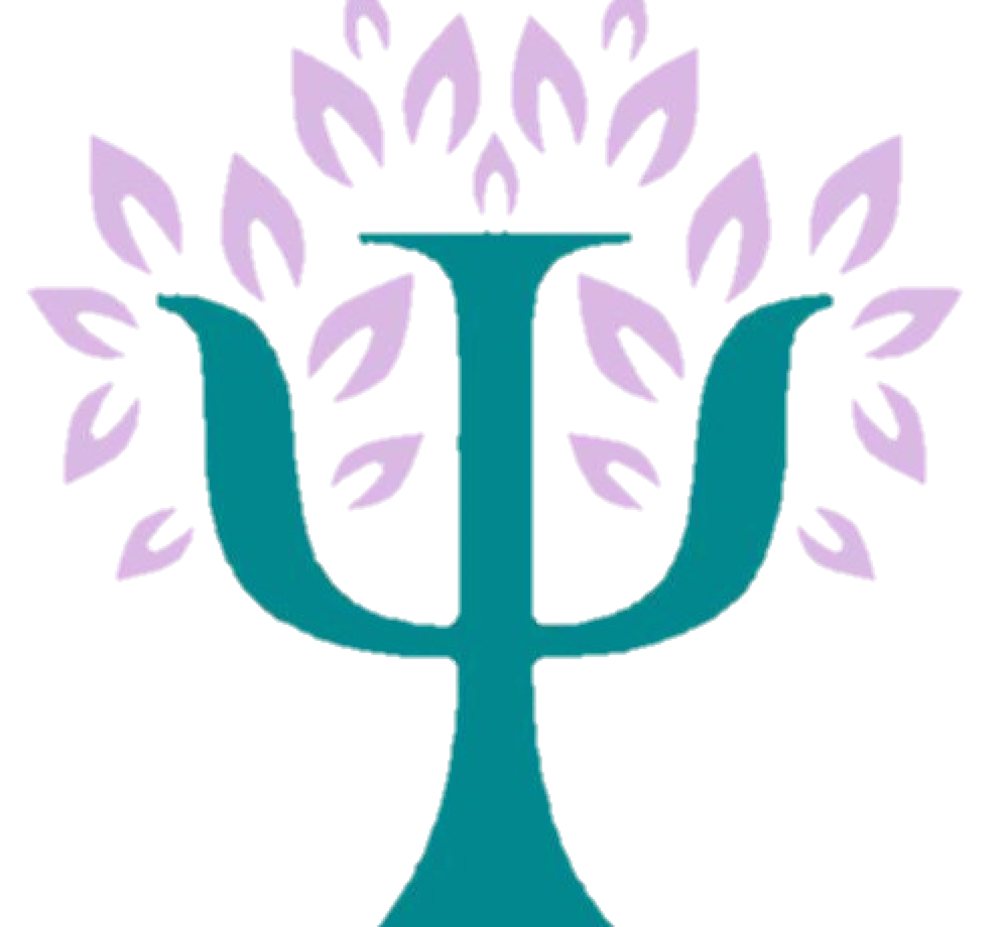

# HEALY 

˖°🩺♡ ***Seu plano de saúde personalizado*** ﮩ٨ـﮩﮩ٨ـ˖𓍢ִ໋ 

 

 
 

# Integrantes
    RM: 551401 Turma: 2TDSPF Nome: Ana Luiza Fontes Franco
    RM: 551856 Turma: 2TDSPF Nome: Beatriz Fon Ehnert de Santi
    RM: 99708  Turma: 2TDSPW Nome: Gabriel Francisco Lobo
    RM: 552295 Turma: 2TDSPF Nome: Matheus Felipe Camarinha Duarte
    RM: 98672  Turma: 2TDSPF Nome: Mirelly Ribeiro Azevedo

 
 

# Diagrama de Estrutura de Pastas

Para acessar o diagrama da Healy, aperte [Diagrama](documentacao/diagrama.png).

 
 

# Sobre o Projeto

Healy é a plataforma digital que facilita a comunicação entre profissionais de saúde e pacientes, colocando o controle da sua saúde em suas mãos. Através de um ambiente intuitivo e seguro, você acessa seus dados médicos, acompanha seus exames e recebe informações claras sobre os custos dos serviços médicos. Com Healy, profissionais têm acesso rápido e completo aos dados dos pacientes, impulsionando decisões mais precisas e eficientes. Healy: Sua saúde, em foco, com tecnologia que conecta!

 
